<p align="center">
  
  <br/>
  
</p>

<h3 align="center">Unmask the hidden before the world does.</h3>

<p align="center">
  An AI-powered agentic red team framework that automates offensive security operations, from reconnaissance to exploitation to post-exploitation, with zero human intervention.
</p>

<p align="center">
  
  
  
  <br/>
  
  
  
  
  
  
  
  
  
  
  
  <br/>
  
  
  
  
  
  
  <br/>
  <a href="https://github.com/samugit83/redamon/wiki"></a>
</p>

> **LEGAL DISCLAIMER**: This tool is intended for **authorized security testing**, **educational purposes**, and **research only**. Never use this system to scan, probe, or attack any system you do not own or have explicit written permission to test. Unauthorized access is **illegal** and punishable by law. By using this tool, you accept **full responsibility** for your actions. **[Read Full Disclaimer](DISCLAIMER.md)**

<p align="center">
  
</p>
<p align="center">
  <a href="https://youtu.be/afViJUit0xE"></a>
</p>
<p align="center">
  <em>Three AI agents attack simultaneously — one brute-forces SSH credentials with Hydra, one chains a CVE to escalate to root and defaces the homepage, one hunts down every XSS vulnerability on the frontend.</em>
</p>

---

## Quick Start

### Prerequisites

- [Docker](https://docs.docker.com/get-docker/) & Docker Compose v2+

That's it. No Node.js, Python, or security tools needed on your host.

#### Minimum System Requirements

| Resource | Without OpenVAS | With OpenVAS (full stack) |
|----------|----------------|--------------------------|
| **CPU** | 2 cores | 4 cores |
| **RAM** | 4 GB | 8 GB (16 GB recommended) |
| **Disk** | 20 GB free | 50 GB free |

> **Without OpenVAS** runs 6 containers: webapp, postgres, neo4j, agent, kali-sandbox, recon-orchestrator.
> **With OpenVAS** adds 4 more runtime containers (gvmd, ospd-openvas, gvm-postgres, gvm-redis) plus ~8 one-shot data-init containers for vulnerability feeds (~170K+ NVTs). First launch takes ~30 minutes for GVM feed synchronization.
> Dynamic recon and scan containers are spawned on-demand during operations and require additional resources.

### 1. Clone & Configure

```bash
git clone https://github.com/samugit83/redamon.git
cd redamon
cp .env.example .env
```

Edit `.env` and add at least one AI provider key:
```env
ANTHROPIC_API_KEY=sk-ant-...   # recommended
# or
OPENAI_API_KEY=sk-proj-...
```
Get your key from [Anthropic Console](https://console.anthropic.com/) or [OpenAI Platform](https://platform.openai.com/api-keys).

**Additional AI providers** (optional — add these to unlock more models):
```env
OPENAI_COMPAT_BASE_URL=http://host.docker.internal:11434/v1  # Ollama on the same machine (see below for remote servers)
OPENAI_COMPAT_API_KEY=                                        # optional (fallback token "ollama" is used if empty)
OPENROUTER_API_KEY=sk-or-...   # OpenRouter — access 300+ models (Llama, Gemini, Mistral, etc.) via openrouter.ai
AWS_ACCESS_KEY_ID=AKIA...      # AWS Bedrock — access foundation models (Claude, Titan, Llama, etc.)
AWS_SECRET_ACCESS_KEY=...      # AWS Bedrock secret key
AWS_DEFAULT_REGION=us-east-1   # AWS Bedrock region (default: us-east-1)
```
The model selector in the project settings **dynamically fetches** available models from each provider whose API key is configured. Only providers with valid keys are shown.

**Optional keys** (add these for extra capabilities):
```env
TAVILY_API_KEY=tvly-...        # Web search for the AI agent — get one at tavily.com
NVD_API_KEY=...                # NIST NVD API — higher rate limits for CVE lookups — nist.gov/developers
```

### 2. Build & Start

```bash
docker compose --profile tools build          # Build all images (recon + vuln-scanner + services)
docker compose up -d                          # Start all services (first GVM run takes ~30 min for feed sync)
                                              # Total image size: ~15 GB
```

**Without GVM (lighter, faster startup):**
```bash
docker compose --profile tools build          # Build all images
docker compose up -d postgres neo4j recon-orchestrator kali-sandbox agent webapp   # Start core services only
```

### 3. Open the Webapp

Go to **http://localhost:3000** — create a project, configure your target, and start scanning.

> For a detailed walkthrough of every feature, check the **[Wiki](https://github.com/samugit83/redamon/wiki)**.

### Common Commands

```bash
docker compose up -d                        # Start all services (including GVM)
docker compose down                         # Stop all services (keeps data)
docker compose ps                           # Check service status
docker compose logs -f                      # Follow all logs
docker compose logs -f webapp               # Webapp (Next.js)
docker compose logs -f agent                # AI agent orchestrator
docker compose logs -f recon-orchestrator   # Recon orchestrator
docker compose logs -f kali-sandbox         # MCP tool servers
docker compose logs -f gvmd                 # GVM vulnerability scanner daemon
docker compose logs -f neo4j                # Neo4j graph database
docker compose logs -f postgres             # PostgreSQL database

# Stop services without removing volumes (preserves all data, fast restart)
docker compose down

# Stop and remove locally built images (forces rebuild on next start)
docker compose --profile tools down --rmi local

# Full cleanup: remove all containers, images, and volumes (destroys all data!)
docker compose --profile tools down --rmi local --volumes --remove-orphans
```

### Development Mode

For active development with **Next.js fast refresh** (no rebuild on every change):

```bash
docker compose -f docker-compose.yml -f docker-compose.dev.yml up -d
```

**Without GVM (lighter, faster startup):**
```bash
docker compose -f docker-compose.yml -f docker-compose.dev.yml up -d postgres neo4j recon-orchestrator kali-sandbox agent webapp
```

The first command starts **all** services including GVM/OpenVAS (which requires a ~30 min feed sync on first run). The second command starts only the core services, skipping GVM entirely — useful when you don't need network-level vulnerability scanning and want a faster, lighter stack.

Both commands swap the production webapp image for a dev container with your source code volume-mounted. Every file save triggers instant hot-reload in the browser.

**Refreshing Python services after code changes:**

The Python services (`agent`, `recon-orchestrator`, `kali-sandbox`) already have their source code volume-mounted, so files are synced live. However, the running Python process won't pick up changes until you restart the container:

```bash
# Restart a single service (picks up code changes instantly)
docker compose restart agent              # AI agent orchestrator
docker compose restart recon-orchestrator  # Recon orchestrator
docker compose restart kali-sandbox       # MCP tool servers
```

No rebuild needed — just restart.

> If you need to update RedAmon to a new version, see [Updating to a New Version](#updating-to-a-new-version).

---

## Table of Contents

- [Overview](#overview)
  - [Reconnaissance Pipeline](#reconnaissance-pipeline)
  - [AI Agent Orchestrator](#ai-agent-orchestrator)
  - [AI Model Providers](#ai-model-providers)
  - [Local Models & OpenAI-Compatible Providers](#openai-compatible-provider)
  - [GitHub Secret Hunter](#github-secret-hunter)
  - [GVM Vulnerability Scanner](#gvm-vulnerability-scanner-optional)
  - [Attack Surface Graph](#attack-surface-graph)
  - [EvoGraph — Attack Chain Evolution](#evograph--attack-chain-evolution)
  - [Multi-Session Parallel Attack Chains](#multi-session-parallel-attack-chains)
  - [Project Settings](#project-settings)
- [System Architecture](#system-architecture)
  - [High-Level Architecture](#high-level-architecture)
  - [Data Flow Pipeline](#data-flow-pipeline)
  - [Docker Container Architecture](#docker-container-architecture)
  - [Exposed Services & Ports](#exposed-services--ports)
- [Components](#components)
  - [Reconnaissance Pipeline](#1-reconnaissance-pipeline)
  - [Graph Database](#2-graph-database)
  - [MCP Tool Servers](#3-mcp-tool-servers)
  - [AI Agent Orchestrator](#4-ai-agent-orchestrator)
  - [Web Application](#5-web-application)
  - [GVM Scanner](#6-gvm-scanner)
  - [GitHub Secret Hunter](#7-github-secret-hunter)
  - [Test Environments](#8-test-environments)
- [Technology Stack](#technology-stack)
  - [Frontend](#frontend)
  - [Backend & API](#backend--api)
  - [AI & LLM](#ai--llm)
  - [Databases](#databases)
  - [Security & Penetration Testing Tools](#security--penetration-testing-tools)
  - [Vulnerability Assessment](#vulnerability-assessment)
  - [Data Sources & Threat Intelligence](#data-sources--threat-intelligence)
  - [Infrastructure & DevOps](#infrastructure--devops)
  - [Protocols & Communication](#protocols--communication)
- [Development Mode](#development-mode)
- [Documentation](#documentation)
- [Data Export & Import](#data-export--import)
- [Updating to a New Version](#updating-to-a-new-version)
- [Legal](#legal)

---

## Overview

RedAmon is a modular, containerized penetration testing framework that chains automated reconnaissance, AI-driven exploitation, and graph-powered intelligence into a single, end-to-end offensive security pipeline. Every component runs inside Docker — no tools installed on your host — and communicates through well-defined APIs so each layer can evolve independently.

The platform is built around five pillars:

| Pillar | What it does |
|--------|-------------|
| **Reconnaissance Pipeline** | Six sequential scanning phases that map your target's entire attack surface — from subdomain discovery to vulnerability detection — and store the results as a rich, queryable graph. Complemented by standalone GVM network scanning and GitHub secret hunting modules. |
| **AI Agent Orchestrator** | A LangGraph-based autonomous agent that reasons about the graph, selects security tools via MCP, transitions through informational / exploitation / post-exploitation phases, and can be steered in real-time via chat. |
| **Attack Surface Graph** | A Neo4j knowledge graph with 17 node types and 20+ relationship types that serves as the single source of truth for every finding — and the primary data source the AI agent queries before every decision. |
| **EvoGraph** | A persistent, evolutionary attack chain graph in Neo4j that tracks every step, finding, decision, and failure across the attack lifecycle — bridging the recon graph and enabling cross-session intelligence accumulation. |
| **Project Settings Engine** | 180+ per-project parameters — exposed through the webapp UI — that control every tool's behavior, from Naabu thread counts to Nuclei severity filters to agent approval gates. |

---

### Reconnaissance Pipeline

The recon pipeline is a fully automated, six-phase scanning engine that runs inside a Kali Linux container. Given a single root domain (or a specific subdomain list), it progressively builds a complete picture of the target's external attack surface. Each phase feeds its output into the next, and the final result is both a structured JSON file and a populated Neo4j graph.

<p align="center">
  
</p>

#### Phase 1 — Domain Discovery

The pipeline starts by mapping the target's subdomain landscape using three complementary techniques:

- **Certificate Transparency** via crt.sh — queries the public CT logs to find every certificate ever issued for the root domain, extracting subdomain names from Subject and SAN fields.
- **HackerTarget API** — a passive lookup that returns known subdomains without sending any traffic to the target.
- **Knockpy** (optional brute-force) — an active subdomain bruteforcer that tests thousands of common prefixes against the target's DNS. Controlled by the `useBruteforceForSubdomains` toggle.
- **WHOIS Lookup** — retrieves registrar, registrant, creation/expiration dates, name servers, and contact information with automatic retry logic and exponential backoff.
- **DNS Resolution** — resolves every discovered subdomain to its A, AAAA, MX, NS, TXT, CNAME, and SOA records, building a map of IP addresses and mail infrastructure.

When a specific `subdomainList` is provided (e.g., `www.`, `api.`, `mail.`), the pipeline skips active discovery and only resolves the specified subdomains — useful for focused assessments.

#### Phase 2 — Port Scanning

All resolved IP addresses are fed into **Naabu**, a fast SYN/CONNECT port scanner. Key capabilities:

- **SYN scanning** (default) with automatic fallback to CONNECT mode if raw sockets are unavailable.
- Top-N port selection (100, 1000, or custom port ranges).
- **CDN/WAF detection** — identifies Cloudflare, Akamai, AWS CloudFront and other CDN providers, optionally excluding them from deeper scans.
- **Passive mode** — queries Shodan's InternetDB instead of sending packets, for zero-touch reconnaissance.
- **IANA service lookup** — maps port numbers to service names using the 15,000-entry IANA registry.

#### Phase 3 — HTTP Probing & Technology Detection

Every host+port combination is probed over HTTP/HTTPS using **httpx** to determine which services are live and what they run:

- **Response metadata** — status codes, content types, page titles, server headers, response times, word/line counts.
- **TLS inspection** — certificate subject, issuer, expiry, cipher suite, JARM fingerprint.
- **Technology fingerprinting** — a dual-engine approach:
  - httpx's built-in detection identifies major frameworks and servers.
  - **Wappalyzer** (6,000+ fingerprints, auto-updated from npm) performs a second pass on the response HTML, catching CMS plugins, JavaScript libraries, and analytics tools that httpx misses. The merge is fully automatic with configurable minimum confidence thresholds.
- **Banner grabbing** — for non-HTTP ports (SSH, FTP, SMTP, MySQL, Redis, etc.), raw socket connections extract service banners and version strings using protocol-specific probe strings.

#### Phase 4 — Resource Enumeration

Three tools run **in parallel** (via ThreadPoolExecutor) to discover every reachable endpoint on the live URLs:

- **Katana** — an active web crawler that follows links to a configurable depth, optionally rendering JavaScript to discover dynamic routes. Extracts forms, input fields, and query parameters.
- **GAU** (GetAllUrls) — a passive discovery tool that queries the Wayback Machine, Common Crawl, AlienVault OTX, and URLScan.io for historical URLs. Results are verified with httpx to filter out dead links, and HTTP methods are detected via OPTIONS probes.
- **Kiterunner** — an API-specific brute-forcer that tests wordlists of common API routes (REST, GraphQL) against each base URL, detecting allowed HTTP methods (GET, POST, PUT, DELETE, PATCH).

Results are merged, deduplicated, and organized by base URL. Every endpoint is classified into categories (auth, file_access, api, dynamic, static, admin) and its parameters are typed (id, file, search, auth_param).

#### Phase 5 — Vulnerability Scanning

The discovered endpoints — especially those with query parameters — are fed into **Nuclei**, a template-based vulnerability scanner with 8,000+ community templates:

- **DAST mode** (active fuzzing) — injects XSS, SQLi, RCE, LFI, SSRF, and SSTI payloads into every discovered parameter. This catches vulnerabilities that signature-only scanning misses.
- **Severity filtering** — scan for critical, high, medium, and/or low findings.
- **Interactsh integration** — out-of-band detection for blind vulnerabilities (SSRF, XXE, blind SQLi) via callback servers.
- **CVE enrichment** — each finding is cross-referenced against the NVD (or Vulners) API for CVSS scores, descriptions, and references.
- **30+ custom security checks** — direct IP access, missing security headers (CSP, HSTS, Referrer-Policy, Permissions-Policy, COOP, CORP, COEP), TLS certificate expiry, DNS security (SPF, DMARC, DNSSEC, zone transfer), open services (Redis without auth, exposed Kubernetes API, SMTP open relay), insecure form actions, and missing rate limiting.

#### Phase 6 — MITRE Enrichment

- **MITRE CWE/CAPEC mapping** — every CVE found in Phase 5 is automatically enriched with its corresponding CWE weakness and CAPEC attack patterns, using an auto-updated database from the CVE2CAPEC repository (24-hour cache TTL).

#### Output

All results are combined into a single JSON file (`recon/output/recon_{PROJECT_ID}.json`) and simultaneously imported into the Neo4j graph database, creating a fully connected knowledge graph of the target's attack surface.

#### Running Reconnaissance

1. Create a project with target domain and settings
2. Navigate to Graph page
3. Click "Start Recon" button
4. Watch real-time logs in the drawer

---

### GVM Vulnerability Scanner (Optional)

After reconnaissance completes, you can optionally run a **GVM/OpenVAS network-level vulnerability scan** to complement the web-layer findings from Nuclei.

#### What is GVM/OpenVAS?

**Greenbone Vulnerability Management (GVM)** — formerly known as OpenVAS — is the world's largest open-source network vulnerability scanner. While Nuclei focuses on web application testing via HTTP templates, GVM operates at a fundamentally different level: it probes services directly at the **protocol layer**, testing for misconfigurations, outdated software, default credentials, and known CVEs across every open port.

The GVM ecosystem consists of several components working together:

- **OpenVAS Scanner (ospd-openvas)** — the scanning engine that executes Network Vulnerability Tests (NVTs) against targets, performing actual protocol-level probes (SSH version checks, SMB enumeration, TLS cipher analysis, banner fingerprinting).
- **GVM Daemon (gvmd)** — the central management service that orchestrates scans, manages scan configs, stores results, and exposes the GMP (Greenbone Management Protocol) API.
- **Vulnerability Feed** — a continuously updated database of **170,000+ NVTs** covering operating systems, network services, databases, embedded devices, industrial control systems, and more — the largest open-source vulnerability test feed available.
- **PostgreSQL + Redis** — backend storage for scan results, NVT metadata, and inter-process communication.

What makes GVM particularly powerful is its **depth of testing**. Unlike signature-based scanners that match HTTP responses against patterns, GVM actively negotiates protocols, authenticates to services, checks software versions against vulnerability databases, tests for default credentials, and probes for misconfigurations that are invisible at the HTTP layer — things like weak SSH ciphers, exposed database ports with no authentication, SNMP community string guessing, and SMB vulnerabilities.

#### Scan Profiles & Time Estimates

GVM includes seven pre-configured scan profiles, each trading thoroughness for speed. Times below are per-target estimates:

| Scan Profile | NVTs | Duration | Description |
|---|---|---|---|
| **Host Discovery** | ~100 | 2-5 min | Basic host detection — is the target alive? |
| **Discovery** | ~500 | 5-10 min | Network discovery — open ports, running services, OS fingerprint |
| **System Discovery** | ~2,000 | 10-20 min | Detailed OS and service enumeration for asset inventory |
| **Full and fast** | ~50,000 | 30-60 min | Comprehensive vulnerability scan using port scan results to select relevant NVTs — **recommended default** |
| **Full and fast ultimate** | ~70,000 | 1-2 hours | Same as above but includes dangerous NVTs that may crash services or hosts |
| **Full and very deep** | ~50,000 | 2-4 hours | Ignores previously collected port/service data and runs all NVTs unconditionally — waits for timeouts on every test, significantly slower |
| **Full and very deep ultimate** | ~70,000 | 4-8 hours | Most thorough and slowest option — runs all NVTs including dangerous ones, ignores prior scan data, waits for all timeouts |

The key difference between "fast" and "very deep" profiles is how they use prior information: **fast** profiles leverage port scan results to skip irrelevant NVTs (e.g., skipping SSH checks on a host with no port 22), while **very deep** profiles ignore all prior data and execute every NVT unconditionally, waiting for timeouts on non-responding services. The "ultimate" variants add NVTs that may cause denial-of-service conditions on the target — use them only in controlled lab environments.

> **Note:** The first GVM startup requires a one-time feed synchronization that takes ~30 minutes. Subsequent starts are instant.

#### Integration with RedAmon

GVM findings are stored as Vulnerability nodes (`source="gvm"`) in Neo4j, linked to IP and Subdomain nodes via `HAS_VULNERABILITY` relationships, with associated CVE nodes. This means the AI agent can reason about both web-layer vulnerabilities (from Nuclei) and network-layer vulnerabilities (from GVM) in a single unified graph.

#### Running a GVM Scan

1. GVM starts automatically with `docker compose up -d` (first run takes ~30 min for feed sync)
2. Navigate to Graph page
3. Click the "GVM Scan" button (enabled only when recon data exists for the project)
4. Watch real-time logs in the GVM logs drawer
5. Download the GVM results JSON when complete

> **Note:** Default GVM credentials are `admin` / `admin` (auto-created by gvmd on first start).

---

### AI Agent Orchestrator

The AI agent is a **LangGraph-based autonomous system** that implements the ReAct (Reasoning + Acting) pattern. It operates in a loop — reason about the current state, select and execute a tool, analyze the results, repeat — until the objective is complete or the user stops it.

#### Three Execution Phases

The agent progresses through three distinct operational phases, each with different tool access and objectives:

**Informational Phase** — The default starting phase. The agent gathers intelligence by querying the Neo4j graph, running web searches for CVE details, performing HTTP requests with curl, and scanning ports with Naabu. No offensive tools are available. The agent analyzes the attack surface, identifies high-value targets, and builds a mental model of what's exploitable.

**Exploitation Phase** — When the agent identifies a viable attack path, it requests a phase transition. This requires **user approval** (configurable). Once approved, the agent gains access to the Metasploit console via MCP and can execute exploits. Three attack path types are supported:

- **CVE Exploit** — the agent searches for a matching Metasploit module, configures the payload (reverse shell or bind shell), sets target parameters, and fires the exploit. For statefull mode, it establishes a Meterpreter session; for stateless mode, it executes one-shot commands.
- **Hydra Brute Force** — the agent uses THC Hydra to brute force credentials against services like SSH, FTP, RDP, SMB, MySQL, HTTP forms, and 50+ other protocols. Hydra settings (threads, timeouts, extra checks) are fully configurable per project. After credentials are discovered, the agent establishes access via `sshpass`, database clients, or Metasploit psexec.
- **Unclassified Fallback** — for techniques that don't match CVE exploit or brute force (e.g., SQL injection, XSS, SSRF, file upload). The agent dynamically classifies the attack type and uses available tools generically without a mandatory workflow. These appear with a grey badge and a `-unclassified` suffix in the classification.

When an exploit succeeds, the agent records a **ChainFinding(exploit_success)** in the [EvoGraph](#evograph--attack-chain-evolution) — recording the attack type, target IP, port, CVE IDs, Metasploit module, payload, session ID, and credentials discovered. This finding is linked to the attack chain step that produced it and bridged to the targeted IP and exploited CVE in the recon graph, making every successful compromise a permanent, queryable, and cross-session-accessible part of the knowledge graph.

<p align="center">
  
</p>

**Post-Exploitation Phase** — After a successful exploit, the agent can optionally transition to post-exploitation (if enabled). In statefull mode (Meterpreter), it runs interactive commands — enumeration, lateral movement, data exfiltration. In stateless mode, it re-runs exploits with different command payloads. This phase also requires user approval.

#### Chat-Based Graph Interaction

Users interact with the agent through a real-time **WebSocket chat interface** in the webapp. You can ask natural language questions and the agent will automatically translate them into Cypher queries against the Neo4j graph:

- *"What vulnerabilities exist on 192.168.1.100?"* — the agent generates a Cypher query, injects tenant filters (so you only see your project's data), executes it, and returns the results in natural language.
- *"Which technologies have critical CVEs?"* — traverses the Technology → CVE relationship chain.
- *"Show me all open ports on the subdomains of example.com"* — walks the Subdomain → IP → Port path.
- *"Find all endpoints with injectable parameters"* — queries Parameter nodes marked as injectable by Nuclei.

The text-to-Cypher system includes 25+ example patterns, handles the critical distinction between Vulnerability nodes (scanner findings, lowercase severity) and CVE nodes (NVD entries, uppercase severity), and automatically retries with error context if a query fails (up to 3 attempts).

#### Real-Time Control

The agent runs as a background task, keeping the WebSocket connection free for control messages:

- **Guidance** — send steering messages while the agent works (e.g., *"Focus on SSH vulnerabilities, ignore web apps"*). These are injected into the system prompt before the next reasoning step.
- **Stop** — pause execution at any point. The agent's state is checkpointed via LangGraph's MemorySaver.
- **Resume** — continue from the last checkpoint with full context preserved.
- **Approval workflows** — phase transitions to exploitation or post-exploitation pause the agent and present a structured request (reason, planned actions, risks) for the user to approve, modify, or abort.

#### MCP Tool Integration

The agent executes security tools through the **Model Context Protocol**, with each tool running in a dedicated server inside the Kali sandbox container:

| Tool | Purpose | Available In |
|------|---------|-------------|
| **query_graph** | Neo4j Cypher queries for target intelligence | All phases |
| **web_search** | Tavily-based CVE/exploit research | All phases |
| **execute_curl** | HTTP requests, API probing, header inspection | All phases |
| **execute_naabu** | Fast port scanning and service detection | All phases |
| **execute_nmap** | Deep service analysis, OS fingerprinting, NSE scripts | All phases |
| **execute_nuclei** | Vulnerability scanning with 9,000+ templates | All phases |
| **kali_shell** | Direct Kali Linux shell commands (arbitrary command execution) | All phases |
| **execute_code** | Run custom Python/Bash exploit scripts on the Kali sandbox | Exploitation & Post-exploitation |
| **execute_hydra** | THC Hydra brute force password cracking (50+ protocols) | Exploitation & Post-exploitation |
| **metasploit_console** | Exploit execution, payload delivery, sessions | Exploitation & Post-exploitation |
| **msf_restart** | Restart Metasploit RPC daemon when it becomes unresponsive | Exploitation & Post-exploitation |

For long-running operations (e.g., Hydra brute force with large wordlists, Metasploit exploits), the agent streams progress updates every 5 seconds to the WebSocket, so you see output in real time.

#### Kali Sandbox Tooling

Beyond the MCP tools listed above, the `kali_shell` and `execute_code` tools give the agent access to the **full Kali Linux toolkit** installed in the sandbox container. The agent can invoke any of these directly via shell commands or compile and run custom exploit scripts on the fly.

**Exploitation & Offensive**

| Tool | Description |
|------|-------------|
| **Metasploit Framework** | Full exploitation framework — exploits, payloads, encoders, auxiliaries, Meterpreter sessions |
| **SQLMap** | Automatic SQL injection detection and exploitation |
| **ExploitDB** | Local copy of the Exploit Database — offline CVE exploit search |
| **John the Ripper** | Password cracker — dictionary, brute force, and rule-based attacks |

**Network & Reconnaissance**

| Tool | Description |
|------|-------------|
| **Nmap** | Network mapper — port scanning, service detection, OS fingerprinting, NSE scripts |
| **Naabu** | Fast SYN/CONNECT port scanner from ProjectDiscovery |
| **Nuclei** | Template-based vulnerability scanner with 9,000+ community templates |
| **curl** | HTTP/HTTPS client — API probing, header inspection, file upload/download |
| **wget** | File download utility |
| **Netcat (nc)** | Swiss-army knife for TCP/UDP — reverse shells, port listeners, data transfer |
| **Socat** | Advanced socket relay — bidirectional data streams, port forwarding, SSL tunnels |
| **dig / nslookup / host** | DNS reconnaissance — record lookups, zone transfers, reverse DNS |
| **SMBClient** | SMB/CIFS protocol client — share enumeration, file access, authentication testing |

**Programming & Scripting**

| Tool | Description |
|------|-------------|
| **Python 3** | Full Python interpreter — write and run custom exploit scripts, parsers, automation |
| **Perl** | Perl interpreter — legacy exploit scripts and text processing |
| **GCC / G++** | C/C++ compilers — compile custom exploits, shellcode, and binary tools on-the-fly |
| **Make** | Build automation for multi-file exploit projects |
| **Go 1.25** | Go compiler — build Go-based security tools from source |
| **Git** | Clone exploit repositories and security tools at runtime |

**Utilities**

| Tool | Description |
|------|-------------|
| **jq** | JSON processor — parse API responses, filter scan results |
| **rlwrap** | Readline wrapper — enhanced interactive shell sessions |
| **net-tools** | Network utilities — `netstat`, `ifconfig`, routing tables |
| **iputils-ping** | ICMP ping for host discovery |

> **Note:** The container runs with `NET_ADMIN`, `NET_RAW`, and `SYS_PTRACE` capabilities, enabling raw socket operations (SYN scanning), packet capture, and process debugging. The agent can also compile and execute C/C++ exploits in-place using `execute_code`.

#### Attack Path Routing

The agent uses an **LLM-powered Intent Router** to classify each user request into the appropriate attack path category. Rather than following a single, fixed exploitation workflow, the router analyzes the user's objective, the available target intelligence from the Neo4j graph, and the current operational phase to select the correct attack chain — each with its own Metasploit workflow, tool sequence, and post-exploitation behavior.

The architecture supports **10 attack path categories** (CVE exploitation, brute force, social engineering, DoS, fuzzing, credential capture, wireless attacks, web application attacks, client-side exploitation, and local privilege escalation), with an implementation roadmap to progressively enable each one. Attack paths can also **chain into each other** — for example, a credential capture can feed captured usernames into a brute force attack, or a fuzzing discovery can chain into CVE research and exploitation.

**Currently implemented attack paths:**

| # | Attack Path | Description | Module Type | Post-Exploitation |
|---|-------------|-------------|-------------|-------------------|
| 1 | **CVE-Based Exploitation** | Exploits known vulnerabilities identified by CVE identifier. The agent searches for a matching Metasploit exploit module, configures target parameters and payload (reverse/bind shell), and fires the exploit. Supports both statefull (Meterpreter session) and stateless (one-shot command) post-exploitation. | `exploit/*` | Yes |
| 2 | **Hydra Brute Force** | Password guessing attacks against 50+ authentication protocols (SSH, FTP, RDP, SMB, MySQL, HTTP forms, and more). The agent uses THC Hydra (`execute_hydra`) with configurable threads, timeouts, and retry strategies. After credentials are discovered, the agent establishes access via `sshpass` (SSH), database clients, or Metasploit psexec (SMB). | `execute_hydra` | Sometimes (SSH, SMB) |
| 3 | **Unclassified Fallback** | Dynamic classification for techniques that don't match CVE or brute force (e.g., `sql_injection-unclassified`, `ssrf-unclassified`). The agent uses all available tools generically without a mandatory workflow. | Any available | Depends on technique |

For full details on all 10 attack path categories, the intent router architecture, chain-specific workflows, and the implementation roadmap, see the **[Attack Paths Documentation](agentic/README.ATTACK_PATHS.md)**.

---

### AI Model Providers

RedAmon supports **five AI providers** out of the box, giving you access to **400+ language models** through a single, unified interface. The model selector in the project settings **dynamically fetches** available models from each configured provider — no hardcoded lists, no manual updates. When a provider releases a new model, it appears automatically.

| Provider | Models | Pricing | API Key Required |
|----------|--------|---------|-----------------|
| **OpenAI** (Direct) | ~30 chat models — GPT-5.2, GPT-5, GPT-4.1, o3, o4-mini, and more | Pay-per-token via OpenAI | `OPENAI_API_KEY` |
| **Anthropic** (Direct) | ~15 models — Claude Opus 4.6, Sonnet 4.6/4.5, Haiku 4.5 | Pay-per-token via Anthropic | `ANTHROPIC_API_KEY` |
| **OpenAI-Compatible** | Any self-hosted or third-party OpenAI-compatible API (for example Ollama, local gateways, proxies). Model lists come directly from your backend; choose chat-capable models manually | Depends on your backend | `OPENAI_COMPAT_BASE_URL` (`OPENAI_COMPAT_API_KEY` optional) |
| **OpenRouter** | **300+ models** — Llama 4, Gemini 3, Mistral, Qwen, DeepSeek, Command R+, and hundreds more from 50+ providers routed through a single API | Variable per model (some free) | `OPENROUTER_API_KEY` |
| **AWS Bedrock** | ~60 foundation models — Claude, Titan, Llama, Cohere Command, Mistral, AI21 Jamba, and more | Pay-per-token via AWS | `AWS_ACCESS_KEY_ID` + `AWS_SECRET_ACCESS_KEY` |

#### How It Works

1. **Provider detection** — On startup, the agent checks which provider credentials/URLs are set in the environment. Only configured providers are queried.
2. **Dynamic model fetching** — The agent's `/models` endpoint fetches available models from all configured providers in parallel (OpenAI API, Anthropic API, OpenAI-compatible `/models`, OpenRouter API, AWS Bedrock `ListFoundationModels`). Results are cached for 1 hour.
3. **Searchable model selector** — The project settings UI presents a searchable dropdown grouped by provider. Each model shows its name, context window size, and pricing info. Type to filter across all providers instantly.
4. **Provider prefix convention** — Models are stored with a provider prefix (`openai_compat/`, `openrouter/`, `bedrock/`) so the agent knows which SDK to use at runtime. OpenAI and Anthropic models are detected by name pattern (no prefix needed). Existing projects continue to work unchanged.

> **Note (OpenAI-Compatible):** RedAmon does not automatically validate chat capability for models returned by your compatible backend. If the backend exposes embedding/audio/image models, select a chat model manually.

#### Provider Setup

```env
# .env — add the keys for the providers you want to use

# Direct providers (lowest latency, direct API connection)
OPENAI_API_KEY=sk-proj-...          # OpenAI — platform.openai.com/api-keys
ANTHROPIC_API_KEY=sk-ant-...        # Anthropic — console.anthropic.com

# OpenAI-compatible providers (self-hosted or third-party)
OPENAI_COMPAT_BASE_URL=http://host.docker.internal:11434/v1  # Ollama on same machine (use IP for remote, e.g. http://192.168.1.50:11434/v1)
OPENAI_COMPAT_API_KEY=                                        # Optional; fallback token "ollama" is used if empty

# Gateway providers (access many models through one key)
OPENROUTER_API_KEY=sk-or-...        # OpenRouter — openrouter.ai/settings/keys

# AWS Bedrock (uses standard AWS credential chain)
AWS_ACCESS_KEY_ID=AKIA...           # IAM user with bedrock:InvokeModel permission
AWS_SECRET_ACCESS_KEY=...           # IAM secret key
AWS_DEFAULT_REGION=us-east-1        # Recommended: us-east-1 (N. Virginia) has the widest model availability
```

> **Note (Bedrock):** Foundation models on AWS Bedrock are now **automatically enabled** across all commercial regions when first invoked — no manual model access activation is required. Just create an IAM user with `bedrock:InvokeModel` and `bedrock:ListFoundationModels` permissions, set the credentials above, and start using any model immediately.

> **Tip:** You can configure multiple providers simultaneously. The model selector will show all available models from all configured providers, letting you switch between a free Llama model on OpenRouter for testing and Claude Opus on Anthropic for production assessments — without changing any code.

#### OpenAI-Compatible Provider

Any backend that exposes the standard `/v1/chat/completions` and `/v1/models` endpoints works out of the box with RedAmon. Set `OPENAI_COMPAT_BASE_URL` in your `.env` and matching models appear in the project settings dropdown automatically.

The agent container already includes `host.docker.internal` resolution, so local servers running on your host machine are reachable from Docker.

**Ollama on the same machine as RedAmon (local):**
```env
OPENAI_COMPAT_BASE_URL=http://host.docker.internal:11434/v1
```

**Ollama on a different machine (remote server):**
```env
OPENAI_COMPAT_BASE_URL=http://192.168.1.50:11434/v1   # replace with your Ollama server's IP or hostname
```
Use the IP address (or hostname) of the remote machine instead of `host.docker.internal`. Make sure port `11434` is reachable from the machine running RedAmon (no firewall blocking it).

> **Important:** By default Ollama only listens on `localhost`, which rejects connections from other machines and from Docker containers. You must bind it to all interfaces (`0.0.0.0`) on the machine running Ollama:
> ```bash
> # If Ollama is managed by systemd (Linux):
> sudo mkdir -p /etc/systemd/system/ollama.service.d
> echo -e '[Service]\nEnvironment="OLLAMA_HOST=0.0.0.0"' | sudo tee /etc/systemd/system/ollama.service.d/override.conf
> sudo systemctl daemon-reload && sudo systemctl restart ollama
> ```
> This is required both for **remote** setups and for **local Linux** setups (Docker containers can't reach `localhost` on the host). macOS and Windows with Docker Desktop handle local resolution automatically, but still need `OLLAMA_HOST=0.0.0.0` if Ollama is accessed from a remote machine.

**Self-hosted / local (free):**

| Provider | Description | Example `OPENAI_COMPAT_BASE_URL` |
|----------|-------------|----------------------------------|
| [Ollama](https://ollama.com/) | Easiest way to run local LLMs — single command setup | `http://host.docker.internal:11434/v1` |
| [vLLM](https://github.com/vllm-project/vllm) | High-performance GPU inference server | `http://host.docker.internal:8000/v1` |
| [LM Studio](https://lmstudio.ai/) | Desktop app with built-in local server | `http://host.docker.internal:1234/v1` |
| [LocalAI](https://localai.io/) | Open-source OpenAI drop-in replacement, runs on CPU | `http://host.docker.internal:8080/v1` |
| [Jan](https://jan.ai/) | Desktop app with ChatGPT-like UI and local server mode | `http://host.docker.internal:1337/v1` |
| [llama.cpp server](https://github.com/ggerganov/llama.cpp) | Lightweight C++ inference | `http://host.docker.internal:8080/v1` |
| [OpenLLM](https://github.com/bentoml/OpenLLM) | Run any open-source LLM with one command | `http://host.docker.internal:3000/v1` |
| [text-generation-webui](https://github.com/oobabooga/text-generation-webui) | Gradio UI with OpenAI-compatible API extension | `http://host.docker.internal:5000/v1` |

**Gateways / proxies (aggregate multiple providers behind one endpoint):**

| Provider | Description |
|----------|-------------|
| [LiteLLM](https://github.com/BerriAI/litellm) | Proxy for 100+ LLMs in OpenAI format — self-hostable via Docker |

**Cloud providers with OpenAI-compatible API:**

| Provider | Description |
|----------|-------------|
| [Together AI](https://together.ai/) | 200+ open-source models, serverless |
| [Groq](https://groq.com/) | Ultra-fast inference for Llama, Mixtral, Gemma |
| [Fireworks AI](https://fireworks.ai/) | Fast open-source model hosting |
| [Deepinfra](https://deepinfra.com/) | Pay-per-token open-source models |
| [Mistral AI](https://mistral.ai/) | Mistral / Mixtral models via OpenAI-compatible endpoint |
| [Perplexity](https://www.perplexity.ai/) | Sonar models via OpenAI-compatible API |

> **Note:** RedAmon fetches all models from your compatible endpoint, including non-chat models (embeddings, audio, image). Make sure to select a **chat-capable** model in project settings.

---

### Attack Surface Graph

The Neo4j graph database is the **single source of truth** for every finding in RedAmon. It stores the complete topology of the target's attack surface as an interconnected knowledge graph, enabling both visual exploration in the webapp and intelligent querying by the AI agent.

#### Node Types

The graph contains **17 recon node types** organized into four categories, plus **5 EvoGraph attack chain node types** (see [EvoGraph](#evograph--attack-chain-evolution) below):

**Infrastructure Nodes** — represent the network topology:

| Node | Key Properties | Description |
|------|---------------|-------------|
| **Domain** | name, registrar, creation_date, expiration_date, WHOIS data | Root domain with full WHOIS information |
| **Subdomain** | name, has_dns_records | Discovered hostname |
| **IP** | address, version, is_cdn, cdn_name, asn | Resolved IP address with CDN/ASN metadata |
| **Port** | number, protocol, state | Open port on an IP |
| **Service** | name, product, version, banner | Running service with version info |

**Web Application Nodes** — represent the application layer:

| Node | Key Properties | Description |
|------|---------------|-------------|
| **BaseURL** | url, status_code, title, server, response_time_ms, resolved_ip | Live HTTP endpoint with full response metadata |
| **Endpoint** | path, method, has_parameters, is_form, source | Discovered URL path with HTTP method |
| **Parameter** | name, position (query/body/header/path), is_injectable | Input parameter, flagged when a vulnerability affects it |

**Technology & Security Nodes** — represent detected software and security posture:

| Node | Key Properties | Description |
|------|---------------|-------------|
| **Technology** | name, version, categories, confidence, detected_by, known_cve_count | Detected framework, library, or server |
| **Header** | name, value, is_security_header | HTTP response header |
| **Certificate** | subject_cn, issuer, not_after, san, tls_version | TLS certificate details |
| **DNSRecord** | type (A/AAAA/MX/NS/TXT/SOA), value, ttl | DNS record for a subdomain |

**Vulnerability & Exploitation Nodes** — represent security findings and successful attacks:

| Node | Key Properties | Description |
|------|---------------|-------------|
| **Vulnerability** | id, name, severity (lowercase), source (nuclei/gvm/security_check), category, curl_command | Scanner finding with evidence |
| **CVE** | id, cvss, severity (uppercase), description, published | Known vulnerability from NVD |
| **MitreData** | cve_id, cwe_id, cwe_name, abstraction | CWE weakness mapping |
| **Capec** | capec_id, name, likelihood, severity, execution_flow | Common attack pattern |
| **ChainFinding** | finding_type, severity, title, evidence, confidence | EvoGraph: agent discovery (replaces legacy Exploit node) — see [EvoGraph](#evograph--attack-chain-evolution) |

#### Relationship Chain

The graph connects these nodes through a directed relationship chain that mirrors real-world infrastructure topology:


Vulnerabilities connect differently depending on their source:
- **Nuclei findings** (web application) → linked via `FOUND_AT` to the specific Endpoint and `AFFECTS_PARAMETER` to the vulnerable Parameter.
- **GVM findings** (network level) → linked via `HAS_VULNERABILITY` directly to the IP and Subdomain nodes, with associated CVE nodes.
- **Security checks** (DNS/email/headers) → linked via `HAS_VULNERABILITY` to the Subdomain or Domain.

#### How the Agent Uses the Graph

Before the agent takes any offensive action, it queries the graph to build situational awareness. This is the core intelligence loop:

1. **Attack surface mapping** — the agent queries the Domain → Subdomain → IP → Port → Service chain to understand what's exposed.
2. **Technology-CVE correlation** — traverses Technology → CVE relationships to find which detected software versions have known vulnerabilities, prioritizing by CVSS score.
3. **Injectable parameter discovery** — queries Parameter nodes flagged as `is_injectable: true` by Nuclei to identify confirmed injection points.
4. **Exploit feasibility assessment** — cross-references open ports, running services, and known CVEs to determine which Metasploit modules are likely to succeed.
5. **Post-exploitation context** — after a successful exploit, the agent creates a `ChainFinding(exploit_success)` in the [EvoGraph](#evograph--attack-chain-evolution), bridged to the target IP and CVE in the recon graph, so subsequent sessions can reference what's already been compromised.

All queries are automatically scoped to the current user and project via regex-based tenant filter injection — the agent never generates tenant filters itself, preventing accidental cross-project data access.

---

### EvoGraph — Attack Chain Evolution

Running parallel to the recon graph, **EvoGraph** (Evolutive Attack Chain Graph) is a persistent, evolutionary graph that tracks everything the AI agent does during exploitation sessions. While the recon graph captures *what exists*, EvoGraph captures *what was tried, what was discovered, what failed, and what decisions were made* — across the entire attack lifecycle.

EvoGraph is not just a logging mechanism — it is the **core intelligence layer** that makes RedAmon's agent fundamentally different from stateless LLM-based tools. By structuring attack chain data as a graph and injecting it into the agent's ReAct prompt in a semantically organized format, EvoGraph transforms raw execution history into actionable operational memory.

#### Structured Chain Context in the ReAct Prompt

Traditional agentic systems feed the LLM a flat, chronological list of every tool call and output — a noisy, token-heavy format where critical intelligence (a discovered credential, a confirmed CVE, a lesson from a failed exploit) is buried among dozens of identical-looking step entries. **EvoGraph replaces this with a structured, semantically partitioned context** injected directly into the ReAct reasoning loop:

| Section | What the LLM Sees | Why It Matters |
|---------|-------------------|----------------|
| **Findings** | All discoveries sorted by severity — critical first (credentials, exploit successes, confirmed vulnerabilities) | The agent immediately knows what has been achieved and can build on it |
| **Failed Attempts** | Each failure with the specific lesson learned ("rockyou-top1000 insufficient for SSH", "port 80 filtered, use 443") | The agent avoids repeating mistakes — no wasted cycles on known dead ends |
| **Decisions** | Phase transitions and strategy changes with rationale | The agent understands the strategic arc of the session |
| **Recent Steps** | Only the last 5 tool executions in compact form | Maintains immediate tactical awareness without flooding the context |

This structured injection **improves agent efficiency by over 25%** compared to flat execution traces. The improvement comes from two compounding effects: the LLM spends fewer reasoning tokens parsing irrelevant context (less noise → faster convergence), and it makes better tactical decisions because critical intelligence is surfaced at the top of its context window rather than buried hundreds of lines deep. The agent finds the right exploit path faster, avoids redundant work, and produces more focused tool calls — fewer wasted iterations, more actionable steps per session.

#### Five Node Types

| Node | Purpose |
|------|---------|
| **AttackChain** | Root of an attack chain — maps 1:1 to a chat session (objective, target, status, outcome) |
| **ChainStep** | Each tool execution — tool name, arguments, output analysis, success/failure |
| **ChainFinding** | Intelligence discovered during a step — vulnerabilities confirmed, credentials found, exploit successes |
| **ChainDecision** | Strategic decision points — phase transitions, strategy changes, user approvals/rejections |
| **ChainFailure** | Structured record of what was tried and why it failed, with lessons learned |

#### Bridge Relationships

EvoGraph nodes connect back to the recon graph through typed bridge relationships:

- **CHAIN_TARGETS** — links an AttackChain to its target IP, Subdomain, Port, or CVE in the recon graph
- **STEP_TARGETED / STEP_EXPLOITED** — links individual steps to the infrastructure they acted on or the CVE they exploited
- **FOUND_ON / FINDING_RELATES_CVE** — links findings to where they were discovered and which CVEs they relate to

This unification means a single Neo4j query can traverse from a recon graph node (e.g., an IP address) through all attack chains that targeted it, every finding discovered, and every failure encountered.

#### Persistent Cross-Session Memory

Every attack chain — with all its steps, findings, decisions, and failures — is **permanently persisted in Neo4j**. This is not ephemeral session state: it is a growing, cumulative knowledge base for the entire project. When a new session starts, the agent automatically loads summaries of all prior chains — high-severity findings, failure lessons, successful exploits, strategic outcomes — and injects them into its initial system prompt.

This means the agent **never starts from zero**. Session B knows that Session A already tried SSH brute force with a small wordlist and failed, that port 80 is filtered, and that a credential was found on the FTP service. It builds on this accumulated intelligence, skipping known dead ends and leveraging prior discoveries. Over multiple sessions, EvoGraph transforms the agent from a stateless tool executor into a **knowledge-accumulating offensive system** where every session makes the next one smarter.

#### Dual Memory Architecture

EvoGraph uses a dual-recording pattern — every event is written to both **in-memory lists** (for instant LLM context via `format_chain_context()`) and **Neo4j** (for persistent cross-session queries via `query_prior_chains()`). The in-memory working memory never depends on graph availability, ensuring zero-latency agent reasoning.

> **Deep dive:** See the [Agentic System Documentation](agentic/README.AGENTIC.md#evograph--evolutive-attack-chain-graph) for full node taxonomy, relationship diagrams, dual memory architecture, orchestrator integration, and the complete comparison of the old flat execution trace vs. the new semantic chain context.

---

### Multi-Session Parallel Attack Chains

RedAmon supports launching **multiple concurrent agent sessions** against the same project. Each session creates its own independent **AttackChain** in the EvoGraph, and all chains persist permanently in Neo4j alongside the full conversation history in PostgreSQL.

This means you can:

- **Run parallel attack strategies** — launch one session targeting SSH brute force while another explores web application CVEs, each operating independently with its own chain of steps, findings, and decisions.
- **Resume any session** — every session appears in the AI drawer's session list. Selecting a session restores its full conversation and chain context, so you can pick up exactly where you left off.
- **Accumulate cross-session intelligence** — when a new session starts, the agent automatically loads findings and failure lessons from *all* prior sessions for the project. Session B knows what Session A already tried, what worked, and what failed — avoiding redundant work and building on prior discoveries.
- **Track everything persistently** — all attack chains, tool executions, findings, and decisions are stored permanently in Neo4j. Nothing is lost when you close the browser or restart the containers. The full attack history is always available for querying and visualization on the graph dashboard.

Each session's attack chain is visually represented on the [graph dashboard](#attack-surface-graph) with distinct coloring — inactive chains render in grey, the active session's chain pulses in orange, and per-session visibility can be toggled from the bottom bar controls.

---

### Project Settings

Every project in RedAmon has **180+ configurable parameters** across 11 setting categories that control the behavior of each reconnaissance module and the AI agent. These settings are managed through the webapp's project form UI, stored in PostgreSQL via Prisma ORM, and fetched by the recon container and agent at runtime.

<p align="center">
  
</p>

| Category | Key Settings |
|----------|-------------|
| **Target & Modules** | Target domain, subdomain list, stealth mode, scan module toggles, Tor routing |
| **Port Scanning** | Naabu scan type, top-N ports, rate limiting, CDN exclusion, passive mode |
| **HTTP Probing** | httpx 25+ probe toggles, TLS inspection, redirect following |
| **Resource Enumeration** | Katana depth/max URLs, GAU passive discovery, Kiterunner API brute-forcing |
| **Vulnerability Scanning** | Nuclei severity filters, DAST mode, template management, Interactsh |
| **CVE & MITRE** | CVE enrichment from NVD/Vulners, CWE/CAPEC mapping |
| **Security Checks** | 25+ individual checks: headers, TLS, DNS, exposed services |
| **GVM Scan** | Scan profiles, target strategy, timeouts |
| **Integrations** | GitHub secret hunting with 40+ regex patterns |
| **Agent Behaviour** | LLM model (400+), phases, payloads, approval gates, limits |
| **Attack Paths** | Hydra brute force, tool phase restriction matrix |

> **Full parameter reference:** See the **[Project Settings Reference](https://github.com/samugit83/redamon/wiki/9.-Project-Settings-Reference)** in the Wiki for all 180+ parameters with defaults and descriptions.
>
> **Complete user guide:** See the **[RedAmon Wiki](https://github.com/samugit83/redamon/wiki)** for step-by-step instructions on creating users, projects, running scans, and using the AI agent.

---

## System Architecture

### High-Level Architecture


### Data Flow Pipeline

```mermaid
flowchart TB
    subgraph Phase1["Phase 1: Reconnaissance"]
        Domain[🌐 Domain] --> Subdomains[📋 Subdomains<br/>crt.sh, HackerTarget, Knockpy]
        Subdomains --> DNS[🔍 DNS Resolution]
        DNS --> Ports[🔌 Port Scan<br/>Naabu]
        Ports --> HTTP[🌍 HTTP Probe<br/>Httpx]
        HTTP --> Tech[🔧 Tech Detection<br/>Wappalyzer]
        Tech --> Vulns[⚠️ Vuln Scan<br/>Nuclei]
    end

    subgraph Phase2["Phase 2: Data Storage"]
        Vulns --> JSON[(JSON Output)]
        JSON --> Graph[(Neo4j Graph)]
    end

    subgraph Phase2b["Phase 2b: Network Vuln Scan (Optional)"]
        JSON -->|IPs + Hostnames| GVM[🛡️ GVM/OpenVAS<br/>170k+ NVTs]
        GVM --> GVMResults[(GVM JSON Output)]
        GVMResults --> Graph
    end

    subgraph Phase2c["Phase 2c: GitHub Secret Hunt (Optional)"]
        JSON -->|Target Domain| GHHunt[🔑 GitHub Secret Hunter<br/>40+ Patterns + Entropy]
        GHHunt --> GHResults[(GitHub Hunt JSON Output)]
        GHResults --> Graph
    end

    subgraph Phase3["Phase 3: AI Analysis"]
        Graph --> Agent[🤖 AI Agent]
        Agent --> Query[Natural Language<br/>→ Cypher Query]
        Query --> Graph
    end

    subgraph Phase4["Phase 4: Exploitation"]
        Agent --> MCP[MCP Tools]
        MCP --> NetworkRecon2[Curl + Naabu<br/>HTTP & Port Scan]
        MCP --> Nuclei2[Nuclei<br/>Vuln Verify]
        MCP --> Nmap2[Nmap<br/>Service Detection]
        MCP --> MSF[Metasploit<br/>Exploit]
        MSF --> Shell[🐚 Shell/Meterpreter]
    end

    subgraph Phase5["Phase 5: Post-Exploitation"]
        Shell --> Enum[Enumeration]
        Enum --> Pivot[Lateral Movement]
        Pivot --> Exfil[Data Exfiltration]
    end
```



### Docker Container Architecture

```mermaid
flowchart TB
    subgraph Host["🖥️ Host Machine"]
        subgraph Containers["Docker Containers"]
            subgraph ReconOrchContainer["recon-orchestrator"]
                OrchAPI[FastAPI :8010]
                DockerSDK[Docker SDK]
                SSEStream[SSE Log Streaming]
            end

            subgraph ReconContainer["recon-container"]
                ReconPy[Python Scripts]
                Naabu1[Naabu]
                Httpx[Httpx]
                Knockpy[Knockpy]
            end

            subgraph MCPContainer["kali-mcp-sandbox"]
                MCPServers[MCP Servers]
                NetworkReconTool[Network Recon :8000<br/>Curl + Naabu]
                NucleiTool[Nuclei :8002]
                MSFTool[Metasploit :8003]
                NmapTool[Nmap :8004]
            end

            subgraph AgenticContainer["agentic-container"]
                FastAPI[FastAPI :8090]
                LangGraph[LangGraph Engine]
                LLMProvider[LLM Provider<br/>OpenAI · Anthropic · Local · OpenRouter · Bedrock]
            end

            subgraph Neo4jContainer["neo4j-container"]
                Neo4jDB[(Neo4j :7687)]
                Browser[Browser :7474]
            end

            subgraph PostgresContainer["postgres-container"]
                PostgresDB[(PostgreSQL :5432)]
                Prisma[Prisma ORM]
            end

            subgraph WebappContainer["webapp-container"]
                NextJS[Next.js :3000]
                PrismaClient[Prisma Client]
            end

            subgraph GVMStack["GVM Stack (Network Vuln Scanner)"]
                GVMd[gvmd<br/>GVM Daemon]
                OSPD[ospd-openvas<br/>Scanner Engine]
                RedisGVM[redis-gvm<br/>Cache/Queue]
                PgGVM[pg-gvm<br/>GVM Database]
                GVMData[Data Containers<br/>VT + SCAP + CERT + Notus]
            end

            subgraph GVMScanContainer["gvm-scanner-container"]
                GVMScanPy[Python Scripts]
                GVMClient[python-gvm Client]
            end

            subgraph GHHuntContainer["github-secret-hunter-container"]
                GHHuntPy[Python Scripts]
                PyGithub[PyGithub Client]
            end

            subgraph GuineaContainer["guinea-pigs"]
                Apache1[Apache 2.4.25<br/>CVE-2017-3167]
                Apache2[Apache 2.4.49<br/>CVE-2021-41773]
            end
        end

        Volumes["📁 Shared Volumes"]
        ReconOrchContainer -->|Manages| ReconContainer
        ReconOrchContainer -->|Manages| GVMScanContainer
        ReconOrchContainer -->|Manages| GHHuntContainer
        GVMScanContainer -->|Unix Socket| GVMd
        GVMd --> OSPD
        GVMd --> PgGVM
        OSPD --> RedisGVM
        GVMData -->|Feed Sync| GVMd
        ReconContainer --> Volumes
        GVMScanContainer -->|Reads Recon Output| Volumes
        Volumes --> Neo4jContainer
        GVMScanContainer --> Neo4jContainer
        WebappContainer --> PostgresContainer
        ReconContainer -->|Fetch Settings| WebappContainer
    end
```



### Exposed Services & Ports

| Service | URL | Description |
|---------|-----|-------------|
| **Webapp** | http://localhost:3000 | Main UI — create projects, configure targets, launch scans |
| PostgreSQL | localhost:5432 | Primary database (Prisma) |
| Neo4j Browser | http://localhost:7474 | Graph database UI for attack surface visualization |
| Neo4j Bolt | localhost:7687 | Neo4j driver protocol (used by agent) |
| Recon Orchestrator | http://localhost:8010 | Manages recon pipeline containers |
| Agent API | http://localhost:8090 | AI agent WebSocket + REST API |
| MCP Network Recon | http://localhost:8000 | curl + naabu (HTTP probing, port scanning) |
| MCP Nuclei | http://localhost:8002 | Nuclei vulnerability scanner |
| MCP Metasploit | http://localhost:8003 | Metasploit Framework RPC |
| MCP Nmap | http://localhost:8004 | Nmap network scanner |
| Metasploit Progress | http://localhost:8013 | Live progress streaming for long-running exploits |
| Metasploit Listener | localhost:4444 | Reverse shell listener (Meterpreter) |

### Recon Pipeline Detail


### Recon Module Data Flow


### Agent Workflow (ReAct Pattern)


### MCP Tool Integration


---

## Components

### 1. Reconnaissance Pipeline

Automated OSINT and vulnerability scanning starting from a single domain.

| Tool | Purpose |
|------|---------|
| crt.sh | Certificate Transparency subdomain discovery |
| HackerTarget | API-based subdomain enumeration |
| Knockpy | Active subdomain bruteforcing |
| Naabu | Fast port scanning |
| Httpx | HTTP probing and technology detection |
| Nuclei | Template-based vulnerability scanning |

📖 **[Read Recon Documentation](recon/README.RECON.md)**

---

### 2. Graph Database

Neo4j-powered attack surface mapping with multi-tenant support.

```
Domain → Subdomain → IP → Port → Service → Technology → Vulnerability → CVE
```

- **Browser UI**: http://localhost:7474
- **Bolt Protocol**: bolt://localhost:7687

📖 **[Read Graph DB Documentation](graph_db/readmes/README.GRAPH_DB.md)**
📖 **[View Graph Schema](graph_db/readmes/GRAPH.SCHEMA.md)**

---

### 3. MCP Tool Servers

Security tools exposed via Model Context Protocol for AI agent integration.

| Server | Port | Tools | Capability |
|--------|------|-------|------------|
| network_recon | 8000 | Curl, Naabu | HTTP requests, header inspection, fast port scanning |
| nuclei | 8002 | Nuclei | 9,000+ vulnerability templates |
| metasploit | 8003 | Metasploit | Exploitation, post-exploitation, sessions |
| nmap | 8004 | Nmap | Service detection, OS fingerprinting, NSE scripts |

📖 **[Read MCP Documentation](mcp/README.MCP.md)**

---

### 4. AI Agent Orchestrator

LangGraph-based autonomous agent with ReAct pattern.

- **WebSocket Streaming**: Real-time updates to frontend
- **Phase-Aware Execution**: Human approval for dangerous operations
- **Memory Persistence**: Conversation history via MemorySaver
- **Multi-Objective Support**: Complex attack chain planning
- **Live Guidance**: Send steering messages to the agent while it works
- **Stop & Resume**: Interrupt execution and resume from the last checkpoint

📖 **[Read Agentic Documentation](agentic/README.AGENTIC.md)**
📖 **[Attack Paths Architecture](agentic/README.ATTACK_PATHS.md)**

---

### 5. Web Application

Next.js dashboard for visualization and AI interaction.

- **Graph Visualization**: Interactive Neo4j graph explorer
- **AI Chat Interface**: WebSocket-based agent communication
- **Node Inspector**: Detailed view of assets and relationships
- **Approval Workflows**: Confirm dangerous tool executions

📖 **[Read Webapp Documentation](webapp/README.WEBAPP.md)**

---

### 6. GVM Scanner

Greenbone Vulnerability Management (GVM), formerly known as OpenVAS, is an enterprise-grade network vulnerability scanner. Unlike Nuclei (which focuses on web application testing via HTTP templates), GVM performs deep network-level vulnerability assessment by probing services directly at the protocol layer — testing for misconfigurations, outdated software, default credentials, and known CVEs across every open port.

- **170,000+ Network Vulnerability Tests (NVTs)** — the largest open-source vulnerability test feed, covering operating systems, network services, databases, and embedded devices.
- **CVSS scoring and CVE mapping** — every finding includes a CVSS score, CVE references, and remediation guidance.
- **Recon output integration** — consumes the IP addresses and hostnames discovered by the recon pipeline, eliminating the need for redundant host discovery.
- **Graph database linkage** — GVM findings are stored as Vulnerability nodes (source="gvm") in Neo4j, linked to IP and Subdomain nodes via `HAS_VULNERABILITY` relationships, with associated CVE nodes — complementing the web-layer findings from Nuclei.
- **Webapp integration** — triggered from the Graph page via a dedicated "GVM Scan" button (requires prior recon data). Logs stream in real-time to a log drawer with 4-phase progress tracking, and results can be downloaded as JSON.

📖 **[Read GVM Documentation](gvm_scan/README.GVM.md)**

---

### 7. GitHub Secret Hunter

Standalone module that scans GitHub repositories, gists, and commit history for exposed secrets and credentials related to your target. Runs independently from the recon pipeline — triggered from the Graph page after reconnaissance completes.

- **40+ secret detection patterns** — regex-based matching for AWS keys, Google Cloud credentials, database connection strings, JWT tokens, private keys, Slack/Discord/Stripe tokens, SSH keys, and more.
- **Shannon entropy analysis** — detects high-entropy strings that may be secrets even when no regex pattern matches, reducing false negatives.
- **Commit history scanning** — examines git diffs to find secrets that were committed and later removed but remain in version history.
- **Organization and member scanning** — enumerates repositories under a target organization and optionally extends to repositories of individual organization members.
- **Gist scanning** — searches public and private gists for leaked credentials.
- **Graph database linkage** — findings are stored in Neo4j and linked to the target's attack surface graph.
- **Webapp integration** — triggered from the Graph page via a dedicated "GitHub Hunt" button (requires prior recon data). Logs stream in real-time to a log drawer with 3-phase progress tracking, and results can be downloaded as JSON.

#### Running a GitHub Secret Hunt

1. Configure a **GitHub Personal Access Token** and **Target Organization** in the project settings (see [GitHub Secret Hunting parameters](#github-secret-hunting) for step-by-step token setup)
2. Navigate to Graph page
3. Click the **GitHub Hunt** button (enabled only when recon data exists for the project)
4. Watch real-time logs in the GitHub Hunt logs drawer (3-phase progress: Loading Settings, Scanning Repositories, Complete)
5. Download the results JSON when complete

> **Note:** The GitHub token is used **exclusively for read-only scanning** — it searches repositories and gists for leaked secrets using pattern matching and entropy analysis. It does not modify, create, or delete any content on GitHub.

---

### 8. Test Environments

> **Status: Under Development** — Guinea pig environments are provided as reference configurations but are not yet fully integrated into the automated pipeline.

Intentionally vulnerable Docker containers for safe, isolated testing. These environments let you validate the full RedAmon pipeline — from reconnaissance to exploitation — without touching any external system.

| Environment | Vulnerability | Description |
|-------------|--------------|-------------|
| Apache 2.4.25 | CVE-2017-3167 | Authentication bypass in `mod_auth_digest`, allowing unauthorized access to protected resources |
| Apache 2.4.49 | CVE-2021-41773 (Path Traversal + RCE) | Path normalization flaw enabling directory traversal and remote code execution via `mod_cgi` |

These containers are designed to be deployed alongside the main stack so the AI agent can discover, scan, and exploit them in a controlled lab environment.

📖 **[Read Guinea Pigs Documentation](guinea_pigs/README.GPIGS.md)**

---

## Technology Stack

### Frontend

| Technology | Role |
|-----------|------|
| **Next.js** (v16) | Full-stack React framework — server-side rendering, API routes, and the project webapp |
| **React** (v19) | Component-based UI library powering all interactive views |
| **TypeScript** | Static typing across the entire frontend codebase |
| **TanStack React Query** | Server state management, caching, and data synchronization |
| **React Force Graph (2D & 3D)** | Interactive attack surface graph visualization |
| **Three.js** | 3D rendering engine behind the 3D graph view |
| **D3 Force** | Force-directed layout algorithms for graph positioning |
| **React Markdown** | Rendering agent chat responses with markdown formatting |
| **React Syntax Highlighter** | Code block highlighting in agent outputs |
| **Lucide React** | Icon system used throughout the UI |

### Backend & API

| Technology | Role |
|-----------|------|
| **FastAPI** | Async Python web framework for the Recon Orchestrator and Agent API |
| **Uvicorn** | ASGI server running both FastAPI services |
| **Pydantic** | Data validation and settings management across all Python services |
| **Docker SDK for Python** | Programmatic container lifecycle management — the Recon Orchestrator uses it to spawn and control recon, GVM, and GitHub hunt containers |
| **SSE (Server-Sent Events)** | Real-time log streaming from recon pipeline and GVM scans to the webapp |
| **WebSocket** | Bidirectional real-time communication between the agent and the webapp chat |

### AI & LLM

| Technology | Role |
|-----------|------|
| **LangChain** | LLM application framework — prompt management, tool binding, chain composition |
| **LangGraph** | State machine engine implementing the ReAct (Reasoning + Acting) agent loop |
| **OpenAI** (Direct) | Supported LLM family — GPT-5.2, GPT-5, GPT-4.1. Requires `OPENAI_API_KEY` |
| **Anthropic** (Direct) | Supported LLM family — Claude Opus 4.6, Sonnet 4.5, Haiku 4.5. Requires `ANTHROPIC_API_KEY` |
| **OpenAI-Compatible** | Any OpenAI-compatible endpoint (for example Ollama). Requires `OPENAI_COMPAT_BASE_URL`; optional `OPENAI_COMPAT_API_KEY` |
| **OpenRouter** | Multi-model gateway — access 300+ models (Llama 4, Gemini 3, Mistral, Qwen, etc.) through a single API key. Uses OpenAI-compatible endpoint. Requires `OPENROUTER_API_KEY` |
| **AWS Bedrock** | Managed AWS service — access foundation models (Claude, Titan, Llama, Cohere, etc.) via `langchain-aws`. Requires `AWS_ACCESS_KEY_ID` + `AWS_SECRET_ACCESS_KEY` |
| **Tavily** | AI-powered web search used by the agent for CVE research and exploit intelligence |
| **Model Context Protocol (MCP)** | Standardized protocol for tool integration — the agent calls security tools through MCP servers |
| **LangChain AWS** | AWS Bedrock integration — `ChatBedrockConverse` for Bedrock foundation models |
| **LangChain MCP Adapters** | Bridges LangChain tool interface with MCP server endpoints |
| **Text-to-Cypher** | LLM-powered natural language to Neo4j Cypher query translation |

### Databases

| Technology | Role |
|-----------|------|
| **Neo4j** (Community Edition) | Graph database — stores the entire attack surface as an interconnected knowledge graph with 17 node types and 20+ relationship types |
| **APOC** | Neo4j plugin providing advanced procedures and functions for graph operations |
| **PostgreSQL** (v16) | Relational database — stores project settings, user accounts, and configuration data |
| **Prisma** | TypeScript ORM for PostgreSQL — schema management, migrations, and type-safe queries |
| **Redis** | In-memory cache and message queue used within the GVM vulnerability scanning stack |

### Security & Penetration Testing Tools

| Tool | Category | Role |
|------|----------|------|
| **Kali Linux** | Base Platform | Penetration testing distribution used as the base Docker image for recon and MCP tool containers |
| **Metasploit Framework** | Exploitation | Exploit execution, payload delivery, Meterpreter sessions, auxiliary scanners, and post-exploitation |
| **Naabu** | Port Scanning | Fast SYN/CONNECT port scanner from ProjectDiscovery |
| **Nmap** | Network Scanning | Network mapper for deep service detection, OS fingerprinting, and NSE vulnerability scripts — exposed as a dedicated MCP server |
| **Nuclei** | Vulnerability Scanning | Template-based scanner with 9,000+ community templates — DAST fuzzing, CVE detection, misconfiguration checks |
| **Httpx** | HTTP Probing | HTTP/HTTPS probing, technology detection, TLS inspection, and response metadata extraction |
| **Katana** | Web Crawling | Active web crawler with JavaScript rendering — discovers URLs, endpoints, forms, and parameters |
| **GAU** (GetAllUrls) | Passive Recon | Passive URL discovery from Wayback Machine, Common Crawl, AlienVault OTX, and URLScan.io |
| **Kiterunner** | API Discovery | API endpoint brute-forcer using real-world Swagger/OpenAPI-derived wordlists |
| **Knockpy** | Subdomain Discovery | Active subdomain brute-forcing tool |
| **Wappalyzer** | Fingerprinting | Technology fingerprinting engine with 6,000+ detection rules |
| **Interactsh** | Out-of-Band Detection | Callback server for detecting blind vulnerabilities (SSRF, XXE, blind SQLi) |
| **Tor / Proxychains4** | Anonymity | Anonymous traffic routing for stealthy reconnaissance |

### Vulnerability Assessment

| Technology | Role |
|-----------|------|
| **GVM / OpenVAS** (Greenbone) | Network-level vulnerability scanner with 170,000+ Network Vulnerability Tests (NVTs) |
| **ospd-openvas** | OpenVAS scanner engine — executes protocol-level probes against target services |
| **gvmd** | GVM daemon — orchestrates scans, manages configurations, and exposes the GMP API |
| **GitHub Secret Hunter** | Custom scanner using 40+ regex patterns and Shannon entropy analysis to detect leaked credentials in GitHub repositories |

### Data Sources & Threat Intelligence

| Source | Role |
|--------|------|
| **NVD** (National Vulnerability Database) | CVE lookup, CVSS scores, and vulnerability descriptions |
| **MITRE CWE / CAPEC** | Weakness classification and common attack pattern mapping for discovered CVEs |
| **Shodan InternetDB** | Passive port and service data without sending packets to the target |
| **crt.sh** | Certificate Transparency log queries for subdomain discovery |
| **Wayback Machine** | Historical URL archive for passive endpoint discovery |
| **Common Crawl** | Web archive data for passive URL collection |
| **AlienVault OTX** | Open threat intelligence feed for URL and indicator enrichment |
| **URLScan.io** | URL scanning and analysis data |
| **HackerTarget** | Passive subdomain enumeration API |
| **Vulners** | Alternative vulnerability database for CVE enrichment |
| **GitHub API** | Repository and code search for secret scanning via PyGithub |

### Infrastructure & DevOps

| Technology | Role |
|-----------|------|
| **Docker** | Container runtime — every component runs containerized with zero host dependencies |
| **Docker Compose** (v2) | Multi-container orchestration — defines and manages the entire 12+ container stack |
| **Docker-in-Docker (DinD)** | Architecture pattern allowing the Recon Orchestrator to spawn ephemeral scan containers |
| **Python** (3.11) | Core language for all backend services — recon pipeline, agent, orchestrator, GVM scanner, GitHub hunter |
| **Node.js** (v22) | JavaScript runtime for the Next.js webapp |
| **Go** (1.25) | Build environment for compiling ProjectDiscovery tools (Naabu, Nuclei) from source |
| **Bash / Shell** | Container entrypoint scripts, tool orchestration, and automation |

### Protocols & Communication

| Protocol | Role |
|----------|------|
| **MCP (Model Context Protocol)** | Standardized tool integration — four MCP servers (Network Recon, Nuclei, Metasploit, Nmap) running inside the Kali sandbox |
| **SSE (Server-Sent Events)** | Unidirectional real-time streaming for recon logs, GVM scan progress, and GitHub hunt output |
| **WebSocket** | Bidirectional real-time communication for the agent chat interface |
| **Bolt** (Neo4j) | Binary protocol for high-performance Neo4j graph database queries |
| **GMP** (Greenbone Management Protocol) | XML-based protocol for communicating with the GVM daemon |
| **REST / HTTP** | Inter-service API communication between all containers |

---

## Documentation

| Component | Documentation |
|-----------|---------------|
| Reconnaissance | [recon/README.RECON.md](recon/README.RECON.md) |
| Recon Orchestrator | [recon_orchestrator/README.md](recon_orchestrator/README.md) |
| Graph Database | [graph_db/readmes/README.GRAPH_DB.md](graph_db/readmes/README.GRAPH_DB.md) |
| Graph Schema | [graph_db/readmes/GRAPH.SCHEMA.md](graph_db/readmes/GRAPH.SCHEMA.md) |
| PostgreSQL Database | [postgres_db/README.md](postgres_db/README.md) |
| MCP Servers | [mcp/README.MCP.md](mcp/README.MCP.md) |
| AI Agent | [agentic/README.AGENTIC.md](agentic/README.AGENTIC.md) |
| EvoGraph | [agentic/README.EVOGRAPH.md](agentic/README.EVOGRAPH.md) |
| Attack Paths | [agentic/README.ATTACK_PATHS.md](agentic/README.ATTACK_PATHS.md) |
| Webapp | [webapp/README.WEBAPP.md](webapp/README.WEBAPP.md) |
| GVM Scanner | [gvm_scan/README.GVM.md](gvm_scan/README.GVM.md) |
| GitHub Secret Hunter | [github_secret_hunt/README.md](github_secret_hunt/README.md) |
| Test Environments | [guinea_pigs/README.GPIGS.md](guinea_pigs/README.GPIGS.md) |
| Changelog | [CHANGELOG.md](CHANGELOG.md) |
| Full Disclaimer | [DISCLAIMER.md](DISCLAIMER.md) |
| License | [LICENSE](LICENSE) |
| **Wiki** | **[Full User Guide & Documentation](https://github.com/samugit83/redamon/wiki)** |

---

## Data Export & Import

RedAmon supports full project backup and restore through the web interface. Each export produces a portable ZIP archive containing all project data, which can be imported on any RedAmon instance.

### What's Included in an Export

| Data | Source | Description |
|------|--------|-------------|
| **Project Settings** | PostgreSQL | All 300+ configuration fields (scan modules, tool parameters, agent behaviour, attack paths) |
| **Agent Conversations** | PostgreSQL | Complete chat history with the AI agent, including tool calls and responses |
| **Attack Surface Graph** | Neo4j | All nodes (domains, subdomains, IPs, ports, services, URLs, vulnerabilities, CVEs, etc.) and their relationships |
| **Recon Output** | Filesystem | Raw JSON output from the reconnaissance pipeline |
| **GVM Results** | Filesystem | Raw JSON output from OpenVAS/GVM vulnerability scans |
| **GitHub Hunt Results** | Filesystem | Raw JSON output from GitHub secret scanning |

### Export a Project

1. Navigate to **Projects** and select a project
2. Open **Project Settings** (gear icon)
3. Click the **Export** button in the header
4. A ZIP file will download automatically

### Import a Project

1. Navigate to **Projects**
2. Select the **user** who will own the imported project
3. Click the **Import Project** button
4. Select a previously exported ZIP file
5. The project will be created under the selected user with all data restored

> **Note**: Imported projects receive new internal IDs. The original project name, settings, conversations, and graph data are fully preserved. You can import the same backup multiple times or under different users.

---

## Updating to a New Version

When updating RedAmon to a new version, all Docker images and volumes are rebuilt from scratch. Follow these steps to preserve your data across updates.

> **Warning**: Step 4 removes all database volumes. Any data not exported will be permanently lost.

### Step-by-Step Update Process

**1. Export all projects**

Before updating, go to the web interface and export every project you want to keep:
- Open each project's **Settings** page
- Click **Export** to download the backup ZIP
- Save all ZIP files in a safe location outside the project directory

**2. Stop all containers**

```bash
docker compose down
```

**3. Pull the latest version**

```bash
git pull origin master
```

**4. Remove old images, containers, and volumes**

```bash
docker compose down --rmi all --volumes
```

This removes all containers, images, and data volumes for a clean rebuild.

**5. Rebuild everything from scratch**

Build the core services and the on-demand tool images (recon scanner, vulnerability scanner, GitHub secret hunter):

```bash
docker compose build --no-cache
docker compose --profile tools build --no-cache
```

**6. Start the new version**

**Full stack** (with GVM/OpenVAS vulnerability scanner):

```bash
docker compose up -d
```

**Core services only** (without GVM — faster startup, lower resource usage):

```bash
docker compose up -d postgres neo4j recon-orchestrator kali-sandbox agent webapp
```

> Use the core-only option if you don't need network vulnerability scanning (GVM/OpenVAS). You can always start the GVM services later with `docker compose up -d`.

**7. Wait for initialization**

Wait for all services to become healthy. If using the full stack with GVM, the first launch requires ~30 minutes for vulnerability feed synchronization.

```bash
docker compose ps   # check service status
```

**8. Import your projects**

Once all services are running:
1. Open the web interface at `http://localhost:3000`
2. Create or select a user
3. Click **Import Project** and upload each exported ZIP file
4. Verify that your projects, graph data, and conversations are restored

---

## Contributing

Contributions are welcome! Please read [CONTRIBUTING.md](CONTRIBUTING.md) for guidelines on how to get started, code style conventions, and the pull request process.

---

## Maintainer

**Samuele Giampieri** — creator and lead maintainer.

- [LinkedIn](https://www.linkedin.com/in/samuele-giampieri-b1b67597/)
- [Devergo Labs](https://www.devergolabs.com/)
- [GitHub](https://github.com/samugit83)

---

## Legal

This project is released under the [MIT License](LICENSE).

See [DISCLAIMER.md](DISCLAIMER.md) for full terms of use, acceptable use policy, and legal compliance requirements.

---

<p align="center">
  <strong>Use responsibly. Test ethically. Defend better.</strong>
</p>
