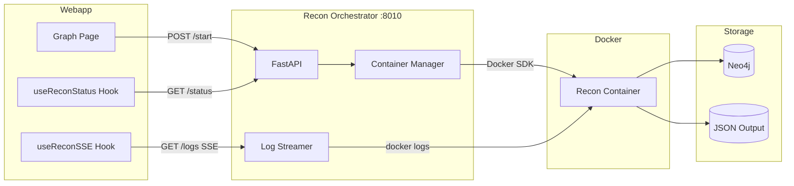

# Recon Orchestrator

FastAPI service for managing recon container lifecycle with real-time log streaming via Server-Sent Events (SSE).

## Overview

The Recon Orchestrator acts as a bridge between the webapp and the recon Docker containers. It provides:

- **Container Lifecycle Management** - Start, stop, and monitor recon containers
- **Real-time Log Streaming** - SSE-based log streaming to the frontend
- **Phase Detection** - Automatic detection of recon phases from log output
- **Status Tracking** - Track running/completed/error states per project

## Architecture



## Quick Start

```bash
# 1. Ensure Docker network exists
docker network create redamon-network

# 2. Build and start
cd recon_orchestrator
docker-compose build
docker-compose up -d

# 3. Verify health
curl http://localhost:8010/health
```

## API Endpoints

### Health Check

```
GET /health
```

Returns service health and running recon count.

```json
{
  "status": "healthy",
  "version": "1.0.0",
  "running_recons": 0
}
```

### Start Recon

```
POST /recon/{projectId}/start
Content-Type: application/json

{
  "user_id": "user-123",
  "webapp_api_url": "http://localhost:3000"
}
```

Starts a new recon container for the specified project. The container will:
1. Fetch project settings from `{webapp_api_url}/api/projects/{projectId}`
2. Run the recon pipeline
3. Update Neo4j with results

**Response:**
```json
{
  "project_id": "project-123",
  "status": "starting",
  "container_id": "abc123...",
  "started_at": "2024-01-15T10:30:00Z",
  "current_phase": null,
  "phase_number": null,
  "total_phases": 7
}
```

### Get Status

```
GET /recon/{projectId}/status
```

Returns current recon status for a project.

**Status Values:**
- `idle` - No recon running
- `starting` - Container starting
- `running` - Recon in progress
- `completed` - Recon finished successfully
- `error` - Recon failed
- `stopping` - Container being stopped

### Stream Logs (SSE)

```
GET /recon/{projectId}/logs
Accept: text/event-stream
```

Server-Sent Events stream of log lines. Events have the following format:

```
event: log
data: {"log": "Starting port scan...", "timestamp": "2024-01-15T10:30:00Z", "phase": "Port Scanning", "phaseNumber": 2, "isPhaseStart": false, "level": "info"}

event: complete
data: {"status": "completed", "completedAt": "2024-01-15T10:45:00Z", "error": null}
```

**Event Types:**
- `log` - Log line with phase detection
- `error` - Error message
- `complete` - Recon completion with final status

**Log Levels:**
- `info` - Normal log line
- `warning` - Warning message
- `error` - Error message
- `success` - Success message (phase completion, etc.)

### Stop Recon

```
POST /recon/{projectId}/stop
```

Gracefully stops a running recon container.

### List Running

```
GET /recon/running
```

Lists all currently running recon processes.

## Phase Detection

The orchestrator automatically detects recon phases from log output:

| Phase | Pattern | Description |
|-------|---------|-------------|
| 1 | `[Phase 1]`, `domain.*discovery` | Domain Discovery |
| 2 | `[Phase 2]`, `port.*scan` | Port Scanning |
| 3 | `[Phase 3]`, `http.*prob` | HTTP Probing |
| 4 | `[Phase 4]`, `resource.*enum` | Resource Enumeration |
| 5 | `[Phase 5]`, `vuln.*scan` | Vulnerability Scanning |
| 6 | `[Phase 6]`, `mitre`, `cwe`, `capec` | MITRE Enrichment |
| 7 | `[Phase 7]`, `github.*secret` | GitHub Secret Hunt |

## Configuration

### Environment Variables

| Variable | Default | Description |
|----------|---------|-------------|
| `RECON_PATH` | `/app/recon` | Path to recon module |
| `RECON_IMAGE` | `redamon-recon:latest` | Docker image for recon |

### Docker Compose

```yaml
services:
  recon-orchestrator:
    build: .
    container_name: redamon-recon-orchestrator
    ports:
      - "8010:8010"
    volumes:
      # Docker socket for container management
      - /var/run/docker.sock:/var/run/docker.sock
      # Recon module path
      - ../recon:/app/recon:ro
      # Output directory
      - ../recon/output:/app/recon/output:rw
    environment:
      - RECON_PATH=/app/recon
      - RECON_IMAGE=redamon-recon:latest

networks:
  default:
    name: redamon-network
    external: true
```

## Container Management

### Recon Container Setup

When starting a recon, the orchestrator:

1. Removes any existing container with the same name
2. Creates a new container with:
   - `network_mode: host` for scanning capabilities
   - `NET_RAW` and `NET_ADMIN` capabilities
   - Docker socket mount for nested container execution
   - Environment variables: `PROJECT_ID`, `USER_ID`, `WEBAPP_API_URL`

### Log Streaming Implementation

Logs are streamed using a thread-based approach:

1. A background thread reads logs synchronously from Docker SDK
2. Logs are pushed to an asyncio queue
3. The async generator yields log events from the queue
4. SSE events are sent to connected clients

This ensures the Docker SDK's synchronous `container.logs()` doesn't block the async event loop.

## Integration with Webapp

### Frontend Hooks

The webapp provides two hooks for recon integration:

**useReconStatus** - Polls status endpoint
```typescript
const { state, startRecon, stopRecon } = useReconStatus({
  projectId,
  enabled: true,
  onComplete: () => refetchGraph()
})
```

**useReconSSE** - Connects to SSE log stream
```typescript
const { logs, currentPhase, currentPhaseNumber } = useReconSSE({
  projectId,
  enabled: state?.status === 'running'
})
```

### API Routes

The webapp proxies requests to the orchestrator:

- `POST /api/recon/[projectId]/start` → `POST :8010/recon/{projectId}/start`
- `GET /api/recon/[projectId]/status` → `GET :8010/recon/{projectId}/status`
- `GET /api/recon/[projectId]/logs` → `GET :8010/recon/{projectId}/logs` (SSE)

## Troubleshooting

### Container Won't Start

1. Check Docker socket is accessible:
   ```bash
   docker exec redamon-recon-orchestrator docker ps
   ```

2. Verify recon image exists:
   ```bash
   docker images | grep redamon-recon
   ```

3. Check orchestrator logs:
   ```bash
   docker logs redamon-recon-orchestrator
   ```

### Logs Not Streaming

1. Verify SSE connection:
   ```bash
   curl -N http://localhost:8010/recon/{projectId}/logs
   ```

2. Check container is running:
   ```bash
   docker ps | grep redamon-recon
   ```

### Connection Refused from Webapp

Ensure the orchestrator is on the same Docker network or accessible from the webapp container.

## Development

### Running Locally

```bash
# Install dependencies
pip install -r requirements.txt

# Run with hot reload
uvicorn api:app --host 0.0.0.0 --port 8010 --reload
```

### Testing Endpoints

```bash
# Start recon
curl -X POST http://localhost:8010/recon/test-project/start \
  -H "Content-Type: application/json" \
  -d '{"user_id": "user-1", "webapp_api_url": "http://localhost:3000"}'

# Check status
curl http://localhost:8010/recon/test-project/status

# Stream logs (Ctrl+C to stop)
curl -N http://localhost:8010/recon/test-project/logs

# Stop recon
curl -X POST http://localhost:8010/recon/test-project/stop
```
